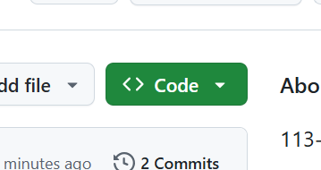
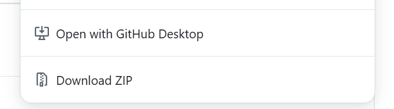
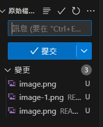
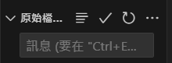
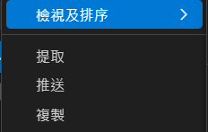

# 資料庫專題
 113-1 資料庫專題

## github push & pull 教學
### 在電腦開啟 Repositories
1. 在網頁上打開 DatabaseProject 的 Repositories
2. 點選綠色的 code 按鈕  
    
3. 如果有安裝 github desktop 選擇 open with github desktop，不然選 7-zip 並解壓縮 
    
4. 開啟 VS code，選擇檔案>開啟資料夾>剛剛下載的資料夾
### push
1. 如果有更新東西，可以點左邊功能欄第三個 
    
2. 在訊息輸入更新資訊 
     
    通常我習慣這樣更新
    - 新增檔案：add [檔案名稱]
    - 編輯檔案：edit [檔案名稱]
    - 刪除檔案：delet [檔案名稱]
3. 按提交>同步
### pull
每次要編輯前建議都先 pull 一次，避免檔案不同步
1. 點選原始檔案控制旁邊的三個點>提取(pull) 
     
    

### 簽到練習區
> 可以在這邊簽到練習  
魏羽彤
蔡詠淇